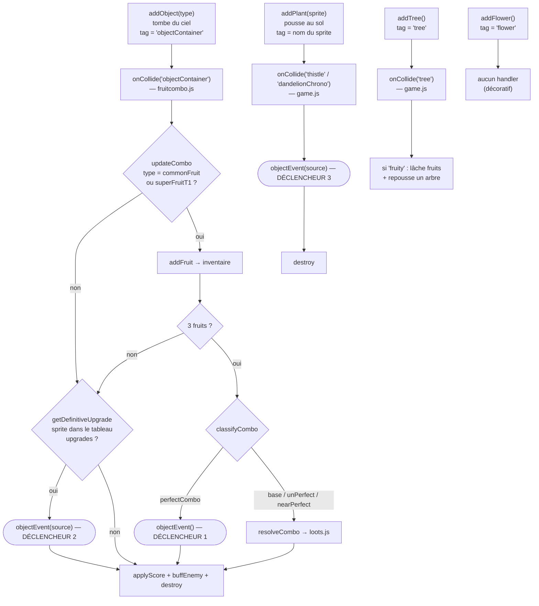
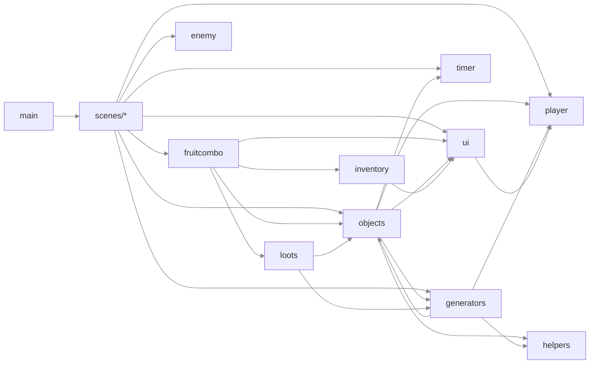

# Fruits'n'Duck — Flux de données internes

Schémas de référence pour comprendre comment un objet passe de son apparition à
son effet. Deux vues : le **flux collision → objectEvent**, et le **graphe des
modules**.

---

## 1. Apparition → collision → effet

Un objet apparaît par l'une de deux fonctions, ce qui détermine son **tag** de
collision. Le tag décide quel handler le capte. Le handler décide si (et comment)
l'`objectEvent` de l'objet se déclenche.

### Les 3 déclencheurs de `objectEvent`

| # | Où | Condition | Qui passe |
|---|----|-----------|-----------|
| 1 | fruitcombo.js — `updateCombo` | trio `perfectCombo` (3 superFruitT1 identiques) | sGrape1, sKumquat1, sPiment1, sPlum1, sTomato1 |
| 2 | fruitcombo.js — `getDefinitiveUpgrade` | sprite ∈ `upgrades` | heartIngame, superHeart, superTomatoArmor, superPiment, samaraSpeed, superStar |
| 3 | game.js — handler plantes | tag ∈ `['thistle', 'dandelionChrono']` | thistle, dandelionChrono |

### ⚠️ Objets dont l'`objectEvent` ne se déclenche JAMAIS

Ces objets ont un `objectEvent` défini mais aucun chemin ne l'appelle :

- **acorn** — spawné en `objectContainer`, mais son sprite n'est pas dans `upgrades`
  et son type n'est ni `commonFruit` ni `superFruitT1`.
- **virus3Red** — même raison (type `virus`, absent de `upgrades`).

Pour les brancher : soit les ajouter au tableau `upgrades`, soit modifier
`getDefinitiveUpgrade` pour tester l'`objectType` au lieu du nom de sprite.

---

## 2. Graphe des dépendances entre modules

Sens des flèches = « importe ». La boucle `generators ↔ objects` est le seul
cycle (bénin aujourd'hui, mais à surveiller).

> Le cycle `objects → generators → objects` fonctionne parce que les fonctions
> concernées (`addObject`, `addTree`, `addFlower`) ne sont appelées qu'au runtime,
> jamais au chargement du module.

---

## 3. États partagés (singletons de module)

Ces objets vivent au niveau module et sont lus/mutés depuis plusieurs fichiers.
C'est là que se logent les bugs de « fuite entre parties ».

| État | Défini dans | Muté depuis | Réinitialisé ? |
|------|-------------|-------------|----------------|
| `playerStats` | player.js | objects.js, game.js | ❌ non |
| `inventorySlots` | inventory.js | fruitcombo.js, player.js | ✅ `initInventory` |
| `scoreStats` | appInit.js | game.js, fruitcombo.js | partiel (`comboCount` seul) |
| timer courant | timer.js | objects.js (`addGameTime`) | recréé par `createTimer` |
